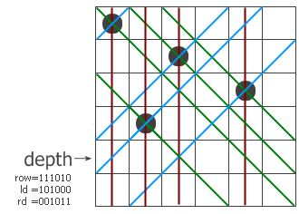

# N皇后问题

- 2020/7/25

> N 皇后问题：在 $N\times N$ 的棋盘上放置 N 个皇后，使其不能互相攻击，即任意两个皇后不能处于同一行、同一列或同一 45° 斜线上。问总共有多少种摆法？

## DFS 或回溯法

最朴素的思想即回溯法或 DFS 搜索，每行向下枚举即可。具体步骤如下：
1. 每次在某一行（此时假设改行前面已经合适摆法了皇后）摆法，遍历该行，检查是否合法
2. 合法，则在该处摆上一个皇后，然后递归向下进行
3. 递归出口：到达最后一行时，即 `row == N` 时，说明已经得到一个解决方案

代码略过，见 [n_queen1.cpp](n_queen1.cpp)文件。

## 位运算解决

> 本文主要参考：[Matrix67 位运算解决 n 皇后问题](http://www.matrix67.com/blog/archives/266)

代码见 [N_Queen.cpp](N_Queen.cpp)和[n_queen2.cpp](n_queen2.cpp)

我们使用 `row`，`ld` 和 `rd`，分别表示在纵列和两个对角线方向的限制条件下，这一行的哪些地方不能放。以下图为例子，


```c++
row = 101010 // 即第一列，第三列，第五列不可放置，是禁位
ld = 100100 
rd = 000111
```

假设现在已经递归到第四层，前三层放的子已经标在左图上了。红色、蓝色和绿色的线分别表示三个方向上有冲突的位置，位于该行上的冲突位置就用 `row`、`ld` 和 `rd` 中的 1 来表示。把它们三个并起来，得到该行所有的禁位，取反后就得到所有可以放的位置（用 `pos` 来表示）。即

```c++
 pos = ~(r | ld | rd);
```

然后取出每个可放置的位置，即等同于将 `pos` 里面的 1 的位置取出来，

```c++
// 取出pos中最右边第一个1的位置
int bit = pos & (~pos + 1);   // 或者 pos & (-pos)
```

此时，`bit` 就是改行可以放置 QUEEN 的位置，把它从 `pos` 中移除，即

```c++
pos  = pos ^ bit;
```
递归调用。注意递归调用时三个参数的变化，每个参数都加上了一个禁位，但两个对角线方向的禁位对下一行的影响需要平移一位。



各个参数变化如下:
```c++
r = r | bit;
ld = (bit | ld) << 1;
rd = (rd | bit) >> 1;
```
最后，如果递归到某个时候发现 `row = 111111`（即 `(1 << N) - 1`）了，说明六个皇后全放进去了，**这里就是递归出口**，说明此时已经找到一个解决方案。
