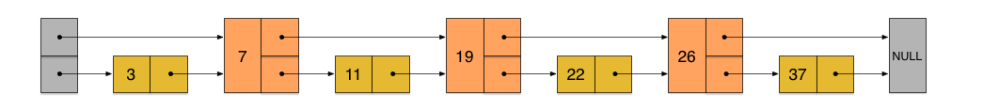
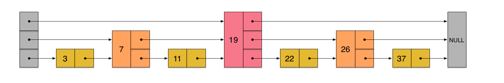
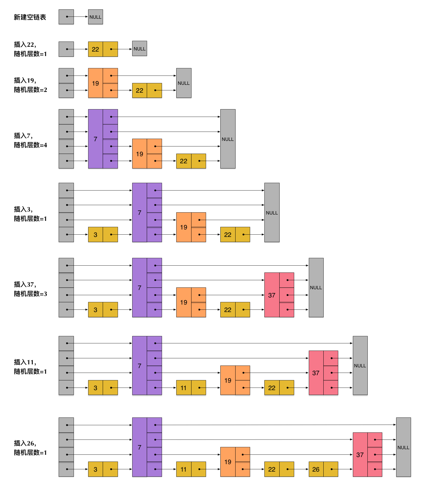
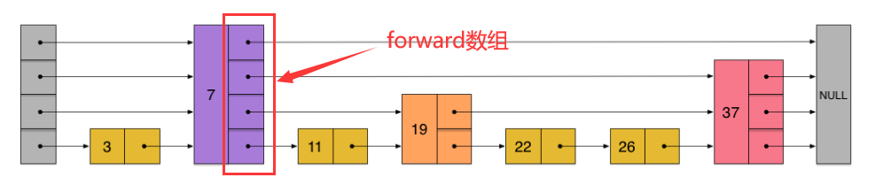
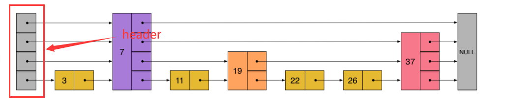
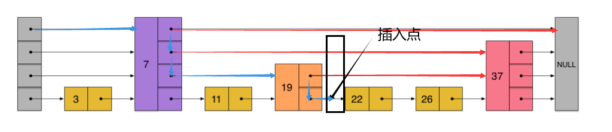
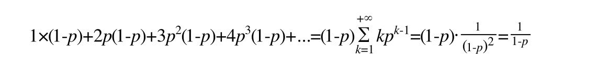
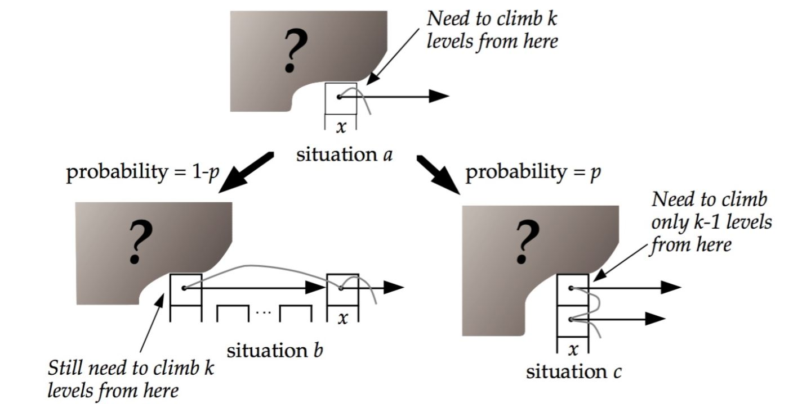

# Skip List 介绍

> Skip list，跳表或跳跃表，出自 William Pugh 一文[ "Skip lists: A probabilistic alternative to balanced trees"](https://dl.acm.org/doi/10.1145/78973.78977).

本文主要参考（copy）了如下文章：
1. [Redis 为什么用跳表而不用平衡树？ - 张铁蕾的文章 - 知乎](https://zhuanlan.zhihu.com/p/23370124)
2. 代码部分：[GeeksforGeeks-Skip-List](https://www.geeksforgeeks.org/skip-list-set-3-searching-deletion/?ref=lbp)

最基本的，Skip list 的两个特点：
- 为了取代 AVL 等平衡二叉搜索树
- probabilistic，具有概率性成分

## Searching  

现代计算机的任务，增删改查是非常 essential 的操作，即基本和重要，也是其精华所在。数据结构中给出了众多结构都可以看作为这个任务服务的。对于查找来说，一般有以下几个选择：

- 当序列支持随机访问（未排序先对其排序），然后采用二分查找算法（C++ 库中的 `binary_search`, `lower_bound`, `upper_bound` 等函数）
- 不支持随机访问的结构，一般必须要遍历整个链表，时间复杂度至少为 O(n)
- 当序列采用 BST（AVL，红黑树等平衡树）等数据结构是，本质上依然是二分查找 O(logn)
    - 如 C++ 中的 `map`，`set`，`unordered_set`，`unordered_map` 等。而 `map` 和 `set` 的区别仅仅在于 `set` 中的 key 和 data 是是否是同一个。`map` 中的 `pair< key,value >`，当然严谨来说，后者的 value 应该称为 data，而 key和 data 组成整个 **Value**。而 `map` 和 `unordered_map` 的区别在于前者底层采用红黑树实现，后者使用哈希表实现。

## 引入 Skip List
一般来说，大部分场景，或者说现在最流行的依然是红黑树和哈希表。而在**高并发**的场景下，BST 树可能会带来较高的 overhead。而且红黑树实现起来较为复杂。

而 skip list 是在链表的基础上来的。


利用建立索引的思想，可以为链表建立索引，从而降低其查找时间。下面先给出 skip list 的感官示意图。



通过"索引"我们就可以快速查找数据。现在，我们的 skip list 的高度为2。比如我们查找23，查找路径沿着下图中的标红的指针方向进行：


比较操作进行如下：
- 先和7比较，同level向后比较，即和19比较，继续同level向后；
- 来到了和26比较，查找的 key 比23大，故要向下一层level继续查找；
- 来到了22位置，继续同level向右，发现比26小；
- 此时，已经是level 0，不可以继续向下，说明链表中没有23（我们可以看到，插入位置我们已经找到了）

当数据不断增加时，我们可以继续为level 1，即第二层建立"索引"。如下，我们已经产生了一个三层链表



此时，我们发现，每一层链表的节点个数都是下一层的个数的一半。这时的 skip list 的查找和二分查找已经等同了。但是，这种方法在插入数据的时候，会遇到问题。新插入一个节点，会打乱这种上下层节点个数2：1的对应关系。如果要维持这种平衡，必须把新插入的节点后面的所有节点（包括新插入的节点）重新进行调整。该操作会将时间复杂度退化到 O(n)。删除同样如此。

> 事实上，从某种角度来看。AVL 树也是如此，对于平衡因子要求很严格（左右高度之差不大于1）。这个特性也是影响其实用性的一大因素。而红黑树，则对此降低了要求，平衡性不要求那么高。 而且从"工业应用"来看，这种平衡性的损失，对性能几乎没影响。

因此，我们可以不要求上下相邻两层之间的节点个数有严格的对应关系（2：1，即在上层新产生的链表上，继续为每相邻的两个节点增加一个指针）。而是给每个节点**随机**（其实之后介绍的概率p决定）产生一个层数（level）。比如，一个节点随机出的层数是3，那么就把它链入到第1层到第3层这三层链表中。为了表达清楚，下图展示了如何通过一步步的插入操作从而形成一个 skip list 的过程：



从上面 skip list 的创建和插入过程可以看出，每一个节点的层数（level）是随机出来的，而且新插入一个节点不会影响其它节点的层数。因此，插入操作只需要修改插入节点前后的指针 （这个之后代码中的`update`负责这部分工作），而不需要对很多节点都进行调整。这就降低了插入操作的复杂度。实际上，这是 skip list 的一个**很重要**的特性，这让它在插入性能上明显优于平衡树的方案。

根据上图中的 skip list 结构，我们很容易理解这种数据结构的名字的由来。skip list，指的就是除了最下面第1层链表之外，它会产生若干层稀疏的链表，这些链表里面的指针故意跳过了一些节点（而且越高层的链表跳过的节点越多）。这就使得我们在查找数据的时候能够先在高层的链表中进行查找，然后逐层降低，最终降到第1层链表来精确地确定数据位置。在这个过程中，我们跳过了一些节点，从而也就加快了查找速度。

刚刚创建的这个 skip list总共包含4层链表，现在假设我们在它里面依然查找23，下图给出了查找路径：


### Skip List 定义
```c++
// skiplist中的结点定义
struct SkipListNode { 
	int key; 
    // 每个skiplist结点维持一个forward数组，该数组大小和该结点的高度有关
    // forward[i]存储一个指向skplist结点的指针，即当前结点在level i，其下一个结点位置
    vector<SkipListNode *> forward;
	SkipListNode(int key, int level){
        this->key = key;
        this->forward.resize(level + 1,NULL);
    } 
}; 
```
其中`forward`数组示意如下，可以看出该数组大小和其层数（高度）相关：


```c++
// skiplist定义
class SkipList {
private:
	// skiplist允许的最大高度 
	int MAXLVL;
	// P就是一个概率，每一个结点有概率P，向上增加一个高度
	float P; // 一般设置为0.5
	// 当前skiplist中除去头结点，其余结点最高的level
	int level;

	SkipListNode* header;
public:
	SkipList(int, float);
};
```
每个 skip list 维持一个`header`，示意如下：

### 

### 插入操作

插入操作包含上面文字叙述部分的搜索过程，先找到插入点，代码如下：
```c++
void SkipList::insertElement(int key) {
	SkipListNode* current = header;
	vector<SkipListNode*> update(MAXLVL + 1, NULL);
    // 从当前最高层数开始查找
	for (int i = level; i >= 0; i--){
		while (current->forward[i] != NULL &&
			current->forward[i]->key < key)
			current = current->forward[i];
		update[i] = current;
	}

    // 此时current是
	current = current->forward[0];
	if (current == NULL || current->key != key){
        // 随机生成新插入节点的层数
		int rlevel = randomLevel();

        // 如果rlevel大于目前为止（未插入新节点前）skiplist的层数，更新它
		// 并且update全置为header
		if (rlevel > level){
			for (int i = level + 1; i < rlevel + 1; i++)
				update[i] = header;
			// Update the list current level 
			level = rlevel;
		}
        // 创建新插入节点
		SkipListNode* new_node = createNode(key, rlevel);
        // 插入节点
		for (int i = 0; i <= rlevel; i++){
			// 将new_node的结点链接好
			new_node->forward[i] = update[i]->forward[i];
			update[i]->forward[i] = new_node;
		}
		cout << "Successfully Inserted key " << key << "\n";
	}
};
```
其中，值得注意的是插入操作中的`update` local 数组，该数组维持着新插入节点，在各个层的前一个节点的信息。比如，现在插入23，则插入点如下，

随机生成的层数为3，则在这个过程中的`update`数组最终为`[7,19,22]`，即指向7的节点指针，指向19的节点指针，指向22的节点的指针。由此可见该数组可以帮助我们将新插入的节点，建立好链表的连接，即

- `new_node`的第3层，即`new_node->forward[2]`插入7代表的节点之后
- `new_node`的第2层，即`new_node->forward[1]`插入19代表的节点之后
- `new_node`的第1层，即`new_node->forward[0]`插入22代表的节点之后

由此插入操作即可完成。

## 随机性下的 Skip List 性能如何？

节点插入时随机产生一个层数，仅仅依靠这样一个简单的随机数操作而构建出来的多层链表结构，能保证它有一个良好的查找性能吗？为了回答这个疑问，我们需要分析 skip list 的统计性能。

在分析之前，我们还需要着重指出的是，执行插入操作时计算随机数的过程，是一个很关键的过程，它对 skip list 的统计特性有着很重要的影响。这并不是一个普通的服从均匀分布的随机数，它的计算过程如下：
- 每个节点都有第1层指针（每个节点都在该层链表中），即level 0层
- 如果一个节点有第i层(i>=1)指针（即节点已经在第1层到第i层链表中），那么它有第(i+1)层指针的概率为p。
- 节点最大的层数不允许超过一个最大值，记为MaxLevel。

计算随机层数的代码如下：
```c++
int randomLevel(){
    float r = (float)rand()/RAND_MAX; 
	int level = 0; 
	while (r < P && level < MAXLVL) { 
		level++; 
		r = (float)rand()/RAND_MAX; 
	} 
	return level; 
}
```

### Skip List 的性能分析

根据前面`randomLevel()`的伪码，我们很容易看出，产生越高的节点层数，概率越低。定量的分析如下：
- 节点层数至少为1。而大于1的节点层数，满足一个概率分布。
- 节点层数恰好等于1的概率为1-p。
- 节点层数大于等于2的概率为p，而节点层数恰好等于2的概率为p(1-p)。
- 节点层数大于等于3的概率为p^2，而节点层数恰好等于3的概率为p^2(1-p)。
- 节点层数大于等于4的概率为p^3，而节点层数恰好等于4的概率为p^3(1-p)。
- ......

因此，一个节点的平均层数（也即包含的平均指针数目），计算如下：



现在很容易计算出：

- 当p=1/2时，每个节点所包含的平均指针数目为2；
- 当p=1/4时，每个节点所包含的平均指针数目为1.33。这也是Redis里的 skip list 实现在空间上的开销。

接下来，为了分析时间复杂度，我们计算一下skiplist的平均查找长度。查找长度指的是查找路径上跨越的跳数，而查找过程中的比较次数就等于查找长度加1。以前面图中标出的查找23的查找路径为例，从左上角的头结点开始，一直到结点22，查找长度为6。

为了计算查找长度，这里我们需要利用一点小技巧。我们注意到，每个节点插入的时候，它的层数是由随机函数randomLevel()计算出来的，而且随机的计算不依赖于其它节点，每次插入过程都是完全独立的。所以，从统计上来说，一个skiplist结构的形成与节点的插入顺序无关。

这样的话，为了计算查找长度，我们可以将查找过程倒过来看，从右下方第1层上最后到达的那个节点开始，沿着查找路径向左向上回溯，类似于爬楼梯的过程。我们假设当回溯到某个节点的时候，它才被插入，这虽然相当于改变了节点的插入顺序，但从统计上不影响整个skiplist的形成结构。

现在假设我们从一个层数为i的节点x出发，需要向左向上攀爬k层。这时我们有两种可能：

- 如果节点x有第(i+1)层指针，那么我们需要向上走。这种情况概率为p。
- 如果节点x没有第(i+1)层指针，那么我们需要向左走。这种情况概率为(1-p)。



用 C(k) 表示向上攀爬k个层级所需要走过的平均查找路径长度（概率期望），那么：
```
C(0)=0
C(k)=(1-p)×(上图中情况b的查找长度) + p×(上图中情况c的查找长度)
```
代入，得到一个差分方程并化简：
```
C(k)=(1-p)(C(k)+1) + p(C(k-1)+1)
C(k)=1/p+C(k-1)
C(k)=k/p
```
这个结果的意思是，我们每爬升1个层级，需要在查找路径上走1/p步。而我们总共需要攀爬的层级数等于整个skiplist的总层数-1。

那么接下来我们需要分析一下当skiplist中有n个节点的时候，它的总层数的概率均值是多少。这个问题直观上比较好理解。根据节点的层数随机算法，容易得出：
- 第1层链表固定有n个节点；
- 第2层链表平均有n*p个节点；
- 第3层链表平均有n*p^2个节点；
- ...

所以，从第1层到最高层，各层链表的平均节点数是一个指数递减的等比数列。容易推算出，总层数的均值为log1/pn，而最高层的平均节点数为1/p。

综上，粗略来计算的话，平均查找长度约等于：

```
C(log1/pn-1)=(log1/pn-1)/p
```

即，平均时间复杂度为O(log n)。更多分析见[ "Skip lists: A probabilistic alternative to balanced trees"](https://dl.acm.org/doi/10.1145/78973.78977).